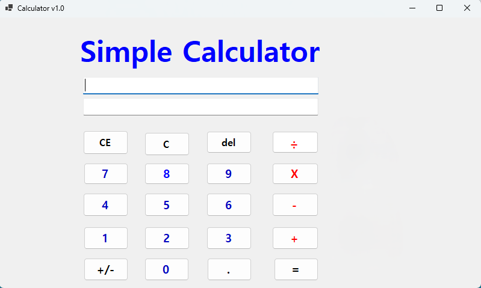
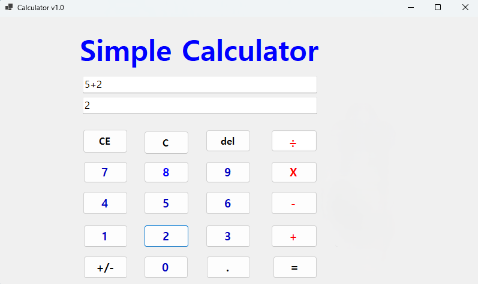
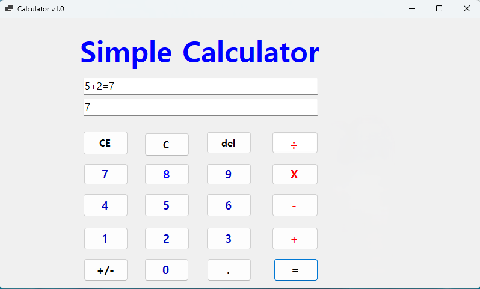
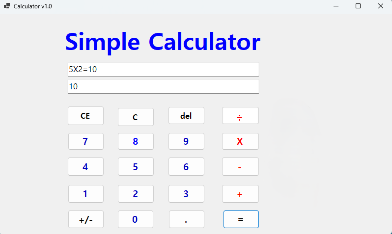
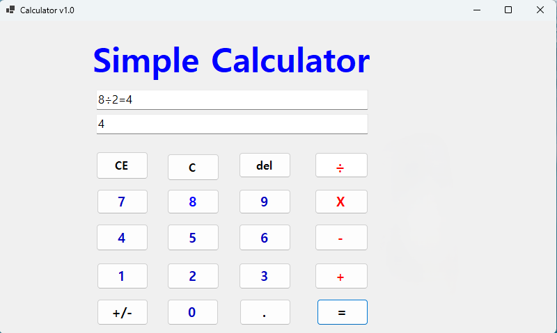
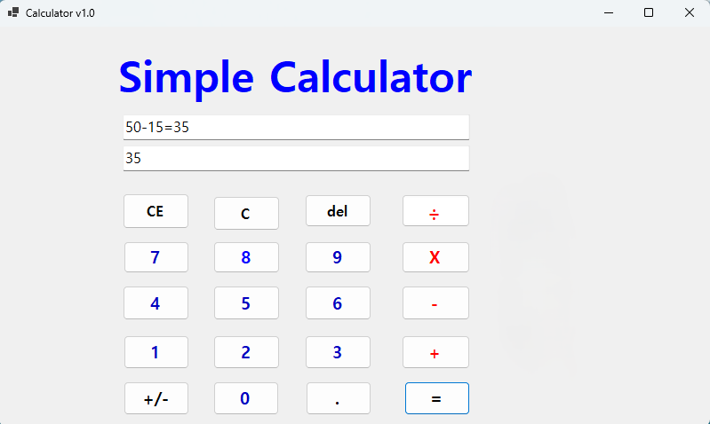
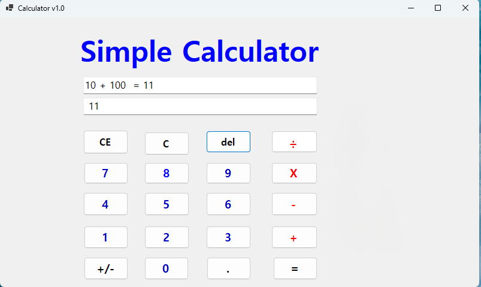
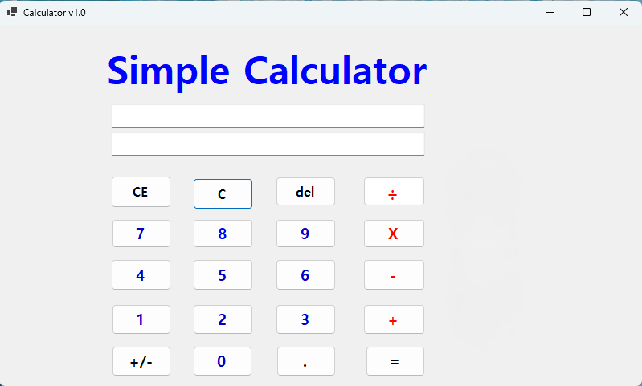
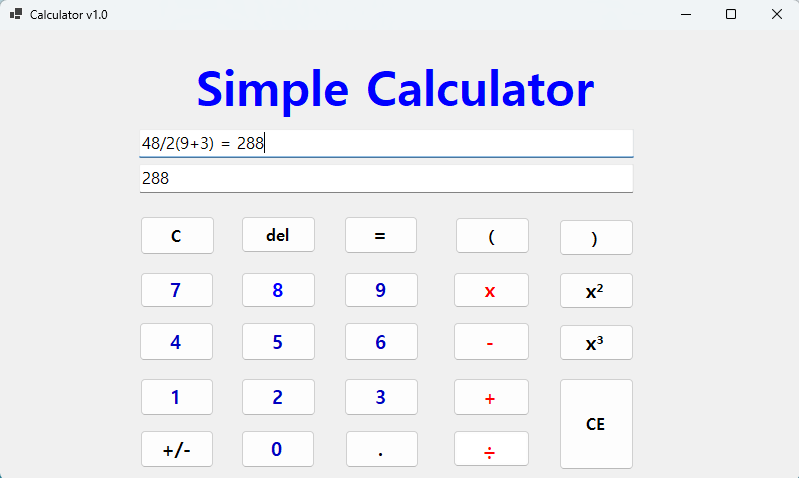
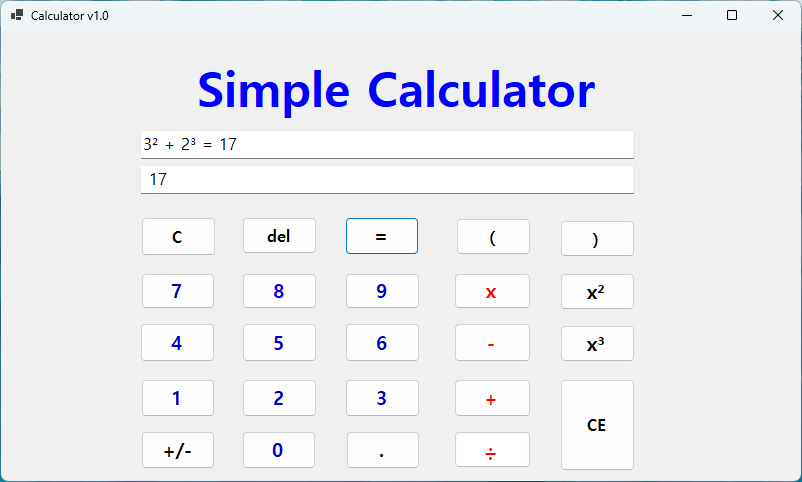

# (C# 코딩) 계산기

## 개요
- C# 프로그래밍 학습
- 1줄 소개: 사용자 키보드와 마우스의 입력을 받아서 계산하는 계산기
- 사용한 플랫폼:
  - Visual Studio 2022
  - .NET Framework 4.8
  - Windows Forms
  - C# 언어
  - GitHub
- 사용한 기술과 구현한 기능:
  - Windows Forms를 사용하여 GUI 구현
  - 사용자 입력 처리 (키보드 및 마우스)
  - 기본 사칙연산 기능 (덧셈, 뺄셈, 곱셈, 나눗셈)
  - 결과 표시 기능
  - 예외 처리 (예: 0으로 나누기)
  - 연산자 우선처리 가능
  - 제곱수 계산 기능

  ## 실행 화면 (과제1)
-  과제1 코드의 실행 스크린샷

	- 기본적인 ui 구성화면

	- 계산 과정 중 textbox에 입력되는 이미지

	- 계산 결과가 textbox에 출력되는 이미지 (textbox위쪽에는 모든 계산 과정이, 아래 textbox에는 결과값만 출력)

- 구현 내용과 기능 설명
	- textbox를 두 개 사용하여 하나의 textbox에는 모든 계산 과정이, 나머지 textbox에는 결과값만 출력되도록 설정
	- button, textbox의 이름을 명확하게 설정하여 코드 가독성 향상
	- button, textbox의 위치를 적절하게 배치하여 인터페이스 형성
	
## 실행 화면 (과제2)
-  과제2 코드의 실행 스크린샷

	- 곱하기 버튼을 눌렀을 때 textbox에 입력되는 이미지

	- 나누기 버튼을 눌렀을 때 textbox에 입력되는 이미지

	- 뺄셈을 입력했을 때 textbox에 입력되는 이미지

	- 더하기와 뺄셈을 연속으로 입력했을 때 textbox에 입력되는 이미지

- 구현 내용과 기능 설명
	- 곱하기 버튼을 추가하여 사칙연산 기능 확장
	- 나누기 버튼을 추가하여 사칙연산 기능 확장
	- 더하기와 뺄셈을 연속으로 입력했을 때도 올바르게 계산되도록 연산자 우선처리 기능 구현

## 실행 화면 (과제3)
-  과제3 코드의 실행 스크린샷

	- 초기 계산 과정이 textbox에 입력되는 이미지

	- 초기 계산 과정에서 CE버튼을 눌렀을 때 textbox에 입력되는 이미지

	- 초기 계산 과정에서 Del버튼을 눌렀을 때 textbox에 입력되는 이미지

	- 초기 계산 과정에서 C버튼을 눌렀을 때 textbox에 입력되는 이미지

- 구현 내용과 기능 설명
	- CE 버튼을 추가하여 현재 입력된 숫자만 지우는 기능 구현
	- Del 버튼을 추가하여 마지막으로 입력된 숫자나 연산자를 지우는 기능 구현
	- C 버튼을 추가하여 모든 계산 과정을 초기화하는 기능 구현

## 실행 화면 (과제4)
- 과제4 코드의 실행 스크린샷

	- 괄호를 사용한 복잡한 사칙연산 계산 과정이 textbox에 입력되는 이미지

	- 제곱수 계산 과정이 textbox에 입력되는 이미지

- 구현 내용과 기능 설명
	- 괄호 버튼을 추가하여 괄호를 사용한 복잡한 사칙연산 계산 기능 구현
	- 제곱 버튼을 추가하여 제곱수 계산 기능 구현
	- 제곱수의 UI를 사용자가 보기 쉽게 구현
	- 사칙연산과 숫자사이에 공백을 추가하여 가독성을 향상시킴

## 배운 내용
- 사칙연산의 기본적인 구현 방법과 연산자 우선처리 방법을 배움
- textbox에 제곱수의 UI가 ^로 설정되어있던것을 가독성이 좋게 x²형태로 변경하고 싶어 Copilot의 도움을 받음
- 여러가지 기능들을 구현하고 싶어 윈도우 기본 계산기와 아이폰 계산기의 기능들을 참고하여 구현함
- 계산기의 UI를 구성할때 AI이미지와 기존 사용되던 계산기의 이미지들을 참고하여 구성함
- 계산기를 마우스만이 아닌 키보드를 사용하여 이용할 수 있게 Copilot의 도움을 받아 키보드 입력 기능을 구현
- README 파일이 github에 업로드 되지 않을 때, 블로그와 AI를 참고하여 해결함